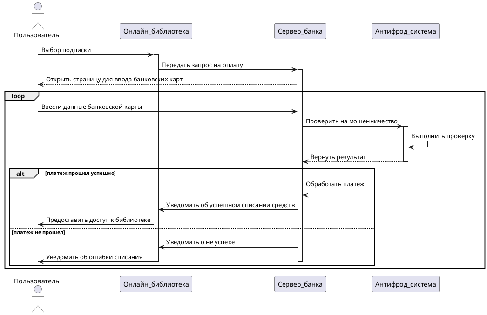

```plantuml

@startuml
actor Пользователь as п
participant Онлайн_библиотека as о
participant Сервер_банка as с
participant Антифрод_система as а

п -> о : Выбор подписки 
activate о
о -> с : Передать запрос на оплату 
activate с
с --> п : Открыть страницу для ввода банковских карт 
loop
п -> с : Ввести данные банковской карты 


с -> а : Проверить на мошенничество
activate а
а -> а : Выполнить проверку
а --> с : Вернуть результат
deactivate а
alt платеж прошел успешно
с -> с : Обработать платеж

с -> о : Уведомить об успешном списании средств
о -> п : Предоставить доступ к библиотеке
else платеж не прошел 
с -> о : Уведомить о не успехе
о -> п : Уведомить об ошибки списания

deactivate с
deactivate о
end alt
end loop
@enduml

```
